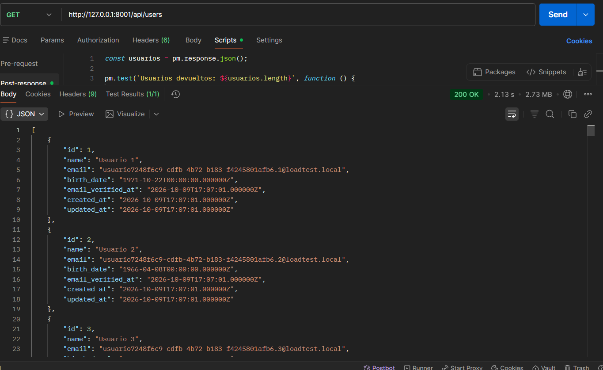
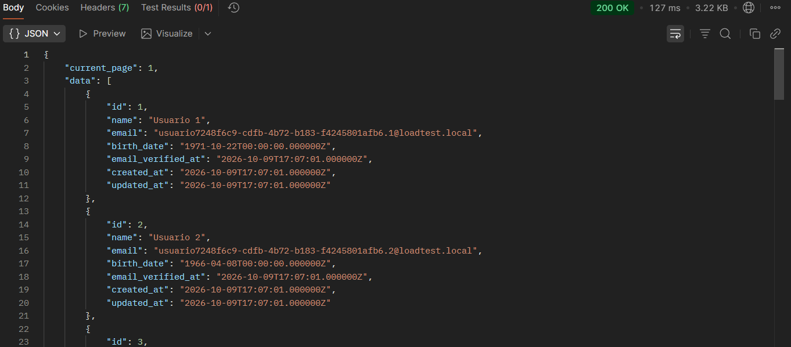
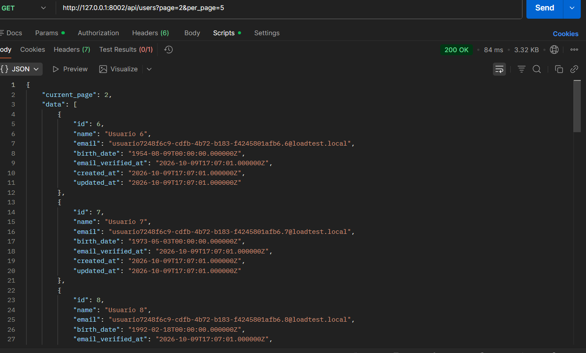
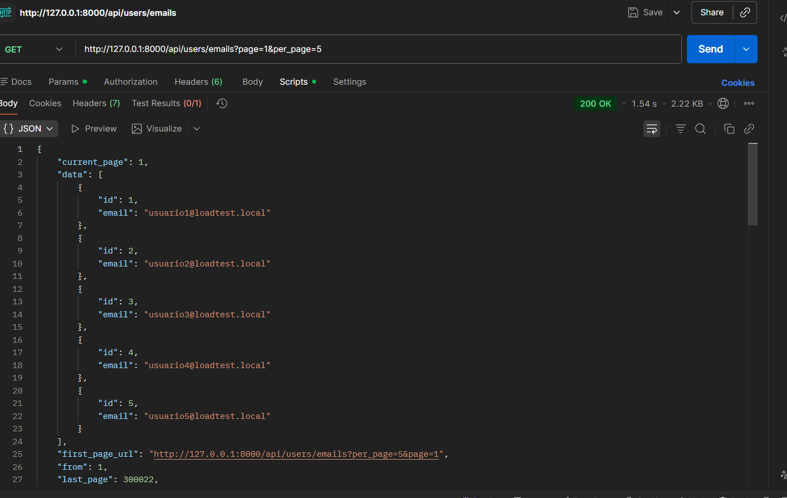
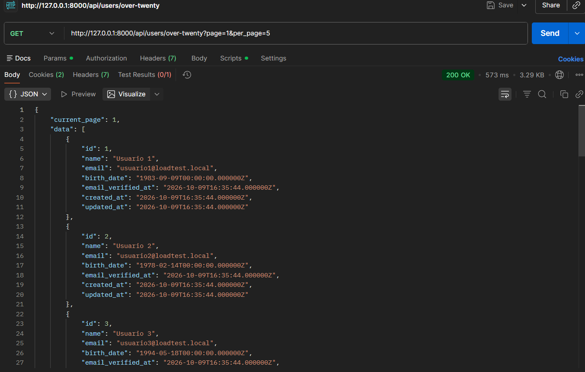
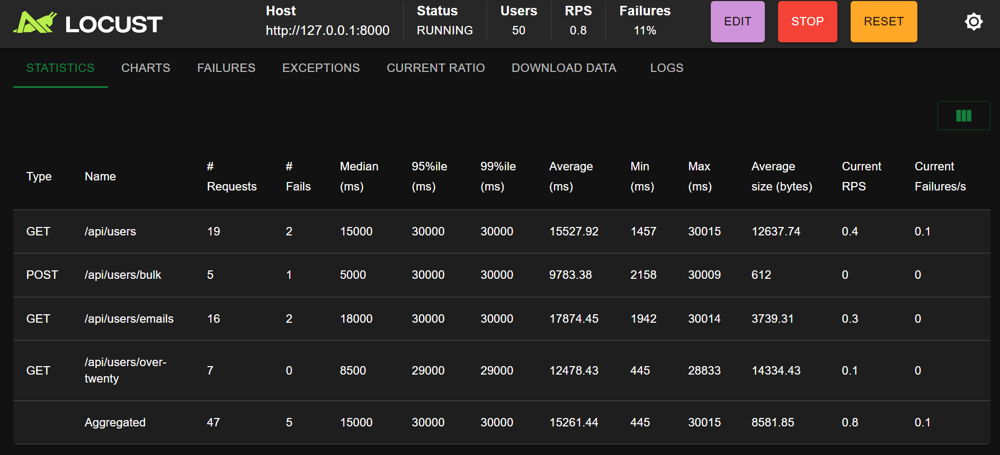

# Informe inicial: pruebas de rendimiento con Locust

Fecha: 9 de octubre de 2026 (America/Bogota). Taller de Ingeniería de Software II.

## Alcance y estado

Se configuró y ejecutó la API, se corrigieron los GET y se implementó Locust. Este informe registra verificaciones y **diagnósticos abreviados**. No equivale a una prueba formal de carga de 10–30 minutos ni a una prueba de capacidad de 60 minutos. Los perfiles completos y sus comandos están en [README.md](../README.md).

## Entorno y metodología

- Windows, Laragon; PHP 8.5.8, Laravel 9 y MySQL 8.0.30. Python 3.10.6 y Locust 2.46.0 en `.venv`.
- CPU AMD Ryzen 7 4700U: 8 núcleos y 8 procesadores lógicos; RAM física aproximada: 15,36 GiB.
- API y generador comparten el equipo. Servidor PHP integrado, un trabajador; host `http://127.0.0.1:8000`.
- Base exclusiva `locust_lab`: 10.000 filas para la verificación inicial, ampliadas después a 1.500.000 sin borrar datos. Los POST agregan tres filas y hacen crecer el dataset durante cada prueba.
- Buffer pool MySQL: 128 MiB. Se ejecutó `ANALYZE TABLE users` tras el sembrado masivo.
- GET paginados: 50 filas, páginas aleatorias de 1 a 10. Filtro por nacimiento anterior a la fecha de corte; índice existente sobre `birth_date`.
- Mezcla aleatoria esperada: 50% listado, 30% correos, 10% filtro de edad y 10% POST. Espera de 1–3 segundos entre tareas. Timeout de 30 segundos.
- `APP_DEBUG=false`, `API_RATE_LIMIT=0`: se desactivó el throttle de 60 peticiones/minuto por IP para evitar que confundiera la medición de capacidad con el límite de acceso.
- Objetivos iniciales elegidos para el laboratorio: p95 <= 1000 ms y fallos <= 1% por operación. No son SLAs suministrados por el docente. Código de salida 1 también indica un objetivo incumplido o cobertura incompleta; no significa necesariamente un error de instalación.

## Cambios y verificación funcional

Los tres GET devuelven `total`, `data` y metadatos de paginación, con `page >= 1`, `per_page` predeterminado 50 y máximo 200. Parámetros inválidos: 422. Página fuera de rango: 200 y arreglo vacío. El filtro de edad se realiza en SQL; excluye a quien cumple exactamente veinte años hoy. Las respuestas ocultan contraseñas y tokens.

Locust comprueba HTTP 200/201, JSON, tamaños de página, orden, filtro de edad y contenido del lote. Los correos usan UUID. Las respuestas 422 se contabilizan como fallos. El sembrado ahora respeta `--count` y `--chunk` y permite agregar lotes sin duplicar correos.

Pruebas automatizadas: **7 pruebas PHP, 62 aserciones**, usando SQLite en memoria; **4 pruebas Python** de contratos. Las dependencias Python pasaron `pip check`.

## Comparación funcional de paginación

Se ejecutaron dos procesos CLI separados sobre las mismas 10.000 filas, reproduciendo la consulta original y la consulta paginada. Incluyen consulta, hidratación y serialización; no son latencias HTTP ni percentiles. La memoria incluye el arranque del framework. Una sola muestra por modo sirve de demostración, no de estimación estadística.

- **all**: 10000 filas; 2195.10 ms; pico 52 MiB; respuesta 2,496,683 bytes.
- **page**: 50 filas; 20.36 ms; pico 18 MiB; respuesta 13,476 bytes.

La paginación reduce las filas cargadas y el tamaño de respuesta. El conteo exacto del total sigue recorriendo un índice: `EXPLAIN` mostró `users_birth_date_index` para `COUNT(*)`. Su coste permanece con el dataset masivo.

### Comparación HTTP aislada para las capturas

Se verificaron dos servidores contra `locust_lab_comparison`, con 10000 filas. El antes usa el commit `afbb181` y el después usa el controlador paginado. La base masiva conserva su configuración. Las peticiones se ejecutaron secuencialmente; son muestras individuales, sin percentiles ni garantía estadística.

- Antes: HTTP 200, 10000 filas, 2866683 bytes y 2531.51 ms.
- Después: HTTP 200, 5 filas, 3077 bytes y 128.25 ms.
- La segunda página devolvió IDs 6 a 10, diferentes de la primera página.

[Comprobación HTTP y huellas de los controladores](evidence/comparison-http.json). Las capturas 01–03 deben hacerse sobre esos servidores y ese dataset.

## Evidencia visual de las peticiones

Capturas reales tomadas en Postman. Los tiempos y tamaños visibles son muestras individuales; pueden diferir de las mediciones CLI y HTTP anteriores. Los indicadores rojos de Test Results en las respuestas paginadas no acreditan pruebas aprobadas: debe revisarse el script de Postman, pues la respuesta ya es un objeto y no el arreglo de la versión anterior.

### Figura 1. Antes de paginar

*GET /api/users en el puerto 8001. La versión original devuelve un arreglo completo. La captura muestra HTTP 200, 2,13 s y 2,73 MB; la base de comparación contiene 10000 filas.*

### Figura 2. Después de paginar: primera página

*Respuesta paginada con current_page=1 y data. La captura muestra HTTP 200, 127 ms y 3,22 KB. Corresponde a la primera página de la misma base de comparación.*

### Figura 3. Segunda página

*GET /api/users?page=2&per_page=5 en el puerto 8002. La respuesta muestra current_page=2 y comienza en el ID 6; HTTP 200, 84 ms y 3,32 KB.*

### Figura 4. Consulta de correos

*GET /api/users/emails?page=1&per_page=5 en el puerto 8000. Los cinco registros contienen únicamente id y email; HTTP 200, 1,54 s y 2,22 KB.*

### Figura 5. Filtro de edad

*GET /api/users/over-twenty?page=1&per_page=5 en el puerto 8000. La respuesta muestra usuarios con birth_date anteriores al corte de veinte años. La captura registra HTTP 200, 573 ms y 3,29 KB.*

## Ejecuciones observadas

### Verificación inicial

10.000 filas; 5 usuarios, spawn rate 1; 30 segundos.

Total: **69 peticiones**, **0 fallos** (0.00%); **2.35 RPS**, p95 agregado **200 ms**.

- `GET /api/users`: 39 peticiones, 0 fallos; p50 51 ms, p95 120 ms, p99 120 ms; 1.33 RPS.
- `POST /api/users/bulk`: 4 peticiones, 0 fallos; p50 220 ms, p95 250 ms, p99 250 ms; 0.14 RPS.
- `GET /api/users/emails`: 21 peticiones, 0 fallos; p50 41 ms, p95 130 ms, p99 190 ms; 0.72 RPS.
- `GET /api/users/over-twenty`: 5 peticiones, 0 fallos; p50 53 ms, p95 68 ms, p99 68 ms; 0.17 RPS.

Evidencia: [estadísticas finales](evidence/smoke-small_final.json) extraídas del informe HTML y [estadísticas CSV](evidence/smoke-small_stats.csv). El CSV periódico puede omitir la última petición respecto al cierre del HTML; las cifras anteriores corresponden al cierre. Los percentiles son aproximaciones de Locust; pocas muestras, especialmente de POST, limitan su precisión.

### Verificación con dataset masivo

1.500.000 filas más altas previas; 5 usuarios, spawn rate 1; 30 segundos.

Total: **31 peticiones**, **0 fallos** (0.00%); **0.92 RPS**, p95 agregado **4400 ms**.

- `GET /api/users`: 19 peticiones, 0 fallos; p50 3700 ms, p95 4700 ms, p99 4700 ms; 0.57 RPS.
- `POST /api/users/bulk`: 5 peticiones, 0 fallos; p50 3200 ms, p95 4000 ms, p99 4000 ms; 0.15 RPS.
- `GET /api/users/emails`: 5 peticiones, 0 fallos; p50 3800 ms, p95 4400 ms, p99 4400 ms; 0.15 RPS.
- `GET /api/users/over-twenty`: 2 peticiones, 0 fallos; p50 1200 ms, p95 1200 ms, p99 1200 ms; 0.06 RPS.

Evidencia: [estadísticas finales](evidence/smoke-full_final.json) extraídas del informe HTML y [estadísticas CSV](evidence/smoke-full_stats.csv). El CSV periódico puede omitir la última petición respecto al cierre del HTML; las cifras anteriores corresponden al cierre. Los percentiles son aproximaciones de Locust; pocas muestras, especialmente de POST, limitan su precisión.

### Diagnóstico de carga

Dataset masivo; 5 usuarios, spawn rate 1; 90 segundos. Duración inferior a la requerida para carga formal.

Total: **72 peticiones**, **0 fallos** (0.00%); **0.76 RPS**, p95 agregado **6700 ms**.

- `GET /api/users`: 38 peticiones, 0 fallos; p50 4400 ms, p95 6700 ms, p99 7400 ms; 0.40 RPS.
- `POST /api/users/bulk`: 9 peticiones, 0 fallos; p50 3800 ms, p95 5300 ms, p99 5300 ms; 0.10 RPS.
- `GET /api/users/emails`: 18 peticiones, 0 fallos; p50 4700 ms, p95 7100 ms, p99 7100 ms; 0.19 RPS.
- `GET /api/users/over-twenty`: 7 peticiones, 0 fallos; p50 4300 ms, p95 6000 ms, p99 6000 ms; 0.07 RPS.

Evidencia: [estadísticas finales](evidence/load-diagnostic_final.json) extraídas del informe HTML y [estadísticas CSV](evidence/load-diagnostic_stats.csv). El CSV periódico puede omitir la última petición respecto al cierre del HTML; las cifras anteriores corresponden al cierre. Los percentiles son aproximaciones de Locust; pocas muestras, especialmente de POST, limitan su precisión.

### Diagnóstico de estrés

Dataset masivo; etapas de 5/10/20/40/80/160 usuarios, spawn rates 5/5/10/10/20/40. 10 segundos por etapa (`LOCUST_STAGE_SECONDS=10`); rampa abreviada, no seis minutos.

Total: **201 peticiones**, **160 fallos** (79.60%); **2.27 RPS**, p95 agregado **30000 ms**.

- `GET /api/users`: 94 peticiones, 75 fallos; p50 30000 ms, p95 30000 ms, p99 30000 ms; 1.06 RPS.
- `POST /api/users/bulk`: 28 peticiones, 23 fallos; p50 30000 ms, p95 30000 ms, p99 30000 ms; 0.32 RPS.
- `GET /api/users/emails`: 60 peticiones, 44 fallos; p50 30000 ms, p95 30000 ms, p99 30000 ms; 0.68 RPS.
- `GET /api/users/over-twenty`: 19 peticiones, 18 fallos; p50 30000 ms, p95 30000 ms, p99 30000 ms; 0.21 RPS.

Máximo observado en el historial: 160 usuarios.
- Primer p95 registrado superior a un segundo: segundo 3, 5 usuarios, 0.00 RPS de completaciones (incluyen fallos), p95 1600 ms.
- Primer intervalo con fallos registrados: segundo 57, 160 usuarios, 0.60 RPS de completaciones (incluyen fallos), p95 30000 ms.

Evidencia: [estadísticas finales](evidence/stress-diagnostic_final.json) extraídas del informe HTML y [estadísticas CSV](evidence/stress-diagnostic_stats.csv). El CSV periódico puede omitir la última petición respecto al cierre del HTML; las cifras anteriores corresponden al cierre. Los percentiles son aproximaciones de Locust; pocas muestras, especialmente de POST, limitan su precisión.

### Diagnóstico sostenido

Dataset masivo; 1 usuario, spawn rate 1; 60 segundos. Comprueba el perfil de capacidad, pero no demuestra resistencia durante una hora.

Total: **19 peticiones**, **0 fallos** (0.00%); **0.32 RPS**, p95 agregado **2500 ms**.

- `GET /api/users`: 12 peticiones, 0 fallos; p50 1500 ms, p95 2500 ms, p99 2500 ms; 0.20 RPS.
- `POST /api/users/bulk`: 2 peticiones, 0 fallos; p50 310 ms, p95 310 ms, p99 310 ms; 0.03 RPS.
- `GET /api/users/emails`: 3 peticiones, 0 fallos; p50 1500 ms, p95 1500 ms, p99 1500 ms; 0.05 RPS.
- `GET /api/users/over-twenty`: 2 peticiones, 0 fallos; p50 490 ms, p95 490 ms, p99 490 ms; 0.03 RPS.

Evidencia: [estadísticas finales](evidence/capacity-diagnostic_final.json) extraídas del informe HTML y [estadísticas CSV](evidence/capacity-diagnostic_stats.csv). El CSV periódico puede omitir la última petición respecto al cierre del HTML; las cifras anteriores corresponden al cierre. Los percentiles son aproximaciones de Locust; pocas muestras, especialmente de POST, limitan su precisión.

## Recursos observados

Muestreo de un segundo durante los diagnósticos. CPU 100% equivale a un núcleo lógico; RSS es memoria residente. Las medias incluyen intervalos de espera entre pruebas y no son promedios por escenario.

- `php.exe` (PID 13876): CPU media 2.67%, máxima 26.10%; RSS mínima/máxima 48.36/48.42 MiB.
- `mysqld.exe` (PID 5096): CPU media 117.49%, máxima 247.60%; RSS mínima/máxima 511.71/514.50 MiB.
- `mysqld.exe` (PID 7904): CPU media 0.00%, máxima 0.00%; RSS mínima/máxima 26.39/26.39 MiB.
- `php.exe` (PID 9600): CPU media 3.91%, máxima 32.80%; RSS mínima/máxima 49.93/50.04 MiB.

[Muestras de recursos](evidence/resources.csv) y [muestras posteriores](evidence/resources-after-stress.csv). El servidor PHP se reinició tras estrés para vaciar la cola.

## Evidencia visual del cliente de Locust

Capturas de Statistics tomadas desde http://127.0.0.1:8089 contra la API principal. El estado visible es **RUNNING**: las cifras corresponden al instante de captura, no al cierre de la ejecución. No se registraron el spawn rate ni la duración de estas ejecuciones. No sustituyen los diagnósticos anteriores ni acreditan pruebas prolongadas.

### Prueba con 5 usuarios

84 peticiones, 0 fallos (0%), p95 agregado 6200 ms, mediana 4000 ms y RPS actual 0,8. Se ejecutaron los cuatro endpoints.

*5 usuarios activos; host http://127.0.0.1:8000; estadísticas acumuladas al instante de captura. Spawn rate y duración no registrados.*

### Prueba con 50 usuarios

47 peticiones, 5 fallos (10,64%; la cabecera redondea a 11%), p95 agregado 30000 ms, mediana 15000 ms y RPS actual 0,8. Se ejecutaron los cuatro endpoints. Aumentan los fallos y la latencia sin una mejora observable del throughput en estas capturas.

*50 usuarios activos; host http://127.0.0.1:8000; estadísticas acumuladas al instante de captura. Spawn rate y duración no registrados.*

**Prueba con 1000 usuarios:** fue planteada, pero no hay una captura disponible que permita documentar su resultado. Tampoco se adjuntaron gráficos de las pruebas con 5 y 50 usuarios.

## Interpretación y pendientes para la entrega formal

- Con pocas filas se verificó el funcionamiento de los cuatro endpoints. Con el dataset masivo ya se incumplió el objetivo de latencia con cinco usuarios, aun sin errores HTTP. Por tanto no se ha demostrado un máximo estable que cumpla el SLA de un segundo.
- El conteo exacto y la cola del servidor de un trabajador explican posibles cuellos de botella. Esta atribución es una interpretación del código, el plan SQL y el montaje; no una prueba causal que separe cada coste.
- En estrés debe relacionarse el historial temporal con la concurrencia y los timeouts. La rampa abreviada y el timeout de 30 segundos pueden desplazar la observación del fallo a una etapa posterior: no atribuir el primer timeout automáticamente a ese número de usuarios.
- Los fallos de estrés registrados como estado 0 representan ausencia de respuesta HTTP. Las duraciones cercanas a 30 segundos son compatibles con el timeout del cliente. El CSV original conserva esa clasificación y no permite separar todas las causas de transporte.
- Ejecutar el perfil de carga durante al menos diez minutos y el estrés de seis etapas de un minuto. Repetir en un servidor con múltiples trabajadores si se busca estimar capacidad de despliegue.
- Elegir la concurrencia de capacidad usando el máximo estable demostrado y ejecutar al menos 60 minutos. Comparar latencias, errores, RPS y memoria a lo largo del tiempo. Un minuto no permite concluir ausencia de fugas de memoria ni resistencia prolongada.
- Registrar el número de filas inicial y final en cada ejecución, porque los POST aumentan el dataset. Conservar exportaciones HTML/CSV y muestras de recursos por escenario.
- Si se optimiza después el conteo o se cambia a paginación por cursor, documentar la modificación del contrato y volver a medir. No ocultar el problema aumentando el SLA sin justificar el cambio.

## Reproducción y referencias

Los comandos, duraciones completas y pasos de navegador están en [README.md](../README.md). Los contratos están en [README-API-LOCUST.md](../README-API-LOCUST.md). La comparación CLI se reproduce con `php scripts/benchmark-pagination.php all` y `page` sobre una base pequeña separada; el modo `all` se niega a ejecutar sobre más de 11.000 filas.

Material del taller: [PDF](../locust_test.pdf). Referencias de implementación: [Locust](https://docs.locust.io/en/stable/writing-a-locustfile.html), [paginación Laravel 9](https://laravel.com/docs/9.x/pagination).

El trabajo y sus evidencias se publican únicamente en el fork personal. No se abre una solicitud de cambios al repositorio original.
